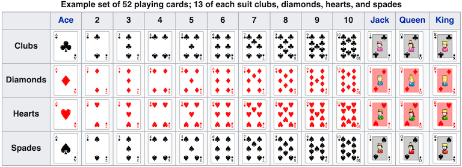

# Blackjack (21)

## Rules

### Game Deck

* This game uses [standard 52 card decks](https://en.wikipedia.org/wiki/Standard_52-card_deck#Composition)
* A gameplay deck can be comprised of multiple 52 card decks

### Card Evalutation

* Ace cards are valued as 1 or 11
* *2* - *10* cards are valued by their rank (i.e. *2* is valued 2)
* Jack, Queen & King cards are valued as 10

### Hand Evalutation

* Any hand with an Ace valued as 11 is called a *soft* hand
* All other hands are *hard* hands
* The total value of a hand is the sum of the values of the cards in the hand
* A hand with a total value greater than 21 is a *bust*
* If a soft hand is bust, then the Ace valued at 11 is revalued at 1
* A hand is always evaluated as soft when possible (i.e. Ace & *6* is *soft 17* not *hard 7* )

### Dealer's Gameplay

* Dealer hits on all hands totaling less than 17 and on soft hands totalling 17
